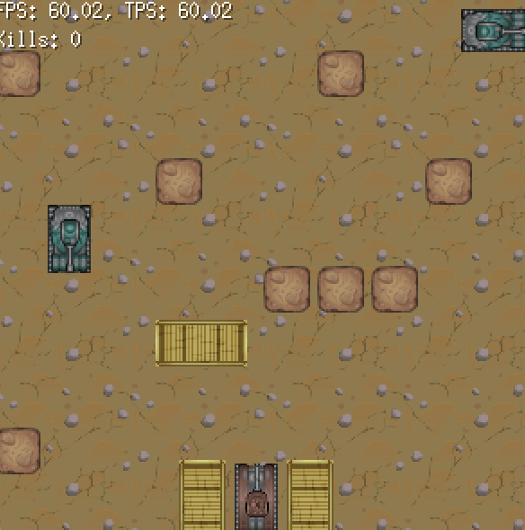

# Tank Battle: First Strike 💥

## A Simple Ebitengine Game for Web & Desktop

[🎮 **Play the Game Online Here!**](https://tanks.tyyrok.online/)

### Overview

Dive into **Tank Battle: First Strike**, a straightforward yet engaging tank combat game developed with the powerful [Ebitengine](https://ebitengine.org/) game engine in Go. Your primary objective: destroy all enemy tanks and conquer the battlefield!

This project marks my first foray into game development with Ebitengine and served as an excellent learning experience in bringing a Go application to the web using WebAssembly (WASM).

### Repository Includes:
- Go source code

### Setup Instructions and Usage Instructions
1. **Clone the repository:**
    ```bash
    git clone https://github.com/your-username/your-repo-name.git
    cd your-repo-name
    ```
2. **Run the game:**
    ```bash
    go run .
    ```

### Screenshots



### Acknowledgements

This project is a personal journey into game development with Ebitengine. A huge thank you to the creators of [Craftpix](https://craftpix.net/) for providing high-quality, free-to-use game assets that truly brought this project to life!